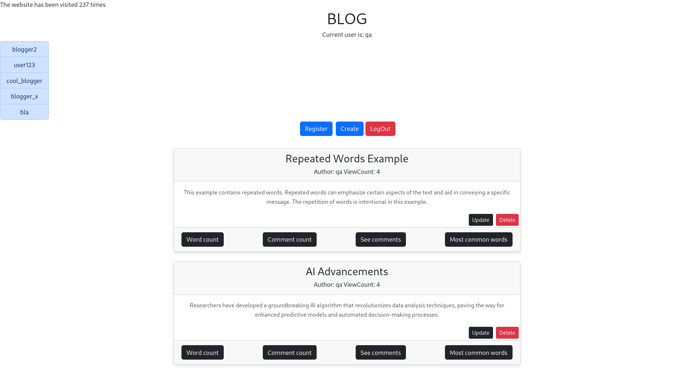

# Microblogging App

This microblogging application was built using the MVC architectural pattern.

### Installation and Startup

To install and start the app, use the following command:

    mvn clean install spring-boot:run

Access the app through your browser at http://localhost:8080.
### Sign In

Use the following credentials to sign in:

    Username: qa
    Password: qa

### RELEASE NOTES

Bugs fixed and functionality added:

* Current user is shown incorrectly - I sign in under “blogger” but it shows “current user is qa” - Fixed by merging frontend and backend together
* The website count is broken - it adds 2 views instead of 1 - Fixed by merging frontend and backend together
* Author of the post is showed incorrectly - Fixed 
* I am supposed to see only my posts - my blog - Fixed by creating a method to return only the current user's posts
* Empty posts without title and content can be created - Fixed by adding validation
* "mvn clean install spring-boot:run"
  * Builds and starts the whole app in one go
* Delete and edit posts of other users - Fixed by implementing validation in backend and disabling functionality in the frontend
* The logged in user has the ability to see posts of other users, navigating to their feed, that increases their post view count
* Implemented individual post view count
* Password security validation when registering. Cannot register if validation not met
* Increased Blog Post length to allow for lengthy posts
* Implemented comments
* Fixed update view not displaying Post title and body

